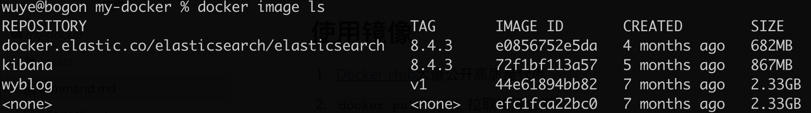

> 命令行记录


## 使用镜像

1. [Docker Hub](https://hub.docker.com/search?q=&type=image)大量公开高质量仓库
2. `docker pull :url` 拉取镜像仓库
3. `docker run -it image_name bash`某个镜像基础上实例一个镜像
   1. -it   
      1. -i 交互式操作
      2. -t 终端
   2. image_name 以某个镜像启动容器
   3. bash  交互式shell命令
4. `docker image ls`查看所有已下载的镜像
   
   1. REPOSITORY    仓库名
   2. TAG 标签
   3. IMAGE ID 镜像唯一ID
   4. CREATED 创建时间
   5. SIZE  大小
5. `docker image rm [<镜像>...]`删除镜像
   1. IMAGE ID进行删除  输入完整名称比较麻烦，可以只输前3个字符以上进行删除  如 `e08` `72f1b`
   2. REPOSITORY 仓库名进行删除
   3. 组合命令删除 `docker image rm $(docker image ls -q kibana) `
6. Dokcerfile来定制镜像
   1. 创建项目 & dockerfile文件
   ```bash
   $ mkdir mynginx
   $ cd mynginx
   $ touch Dockerfile
   ```
   2. 修改dockerfile文件内容
   ```Dockerfile
   # 你的基础镜像
   FROM nginx
   # 建立好的镜像后进一步shell操作  多个RUN可以进行合并
   RUN echo '<h1>Hello, Docker!</h1>' > /usr/share/nginx/html/index.html
       && echo '<h1>Hello, My Docker!</h1>' > /usr/share/nginx/html/index.html
   # 也可执行exec程序  RUN ["可执行文件", "参数1", "参数2"] 
   RUN ["test", "arg1", "arg2"]
   ```
   4. 构建镜像
   `docker build -t nginx:tagName .`
   以上步骤就完成就会生成一个image镜像(经过自己定制修改的),  其余dockerfile中的命令还有 `ADD`、`COPY`, 详细的后面会专门总结。

## 操作容器


## 访问仓库

## 数据管理

## 使用网络

